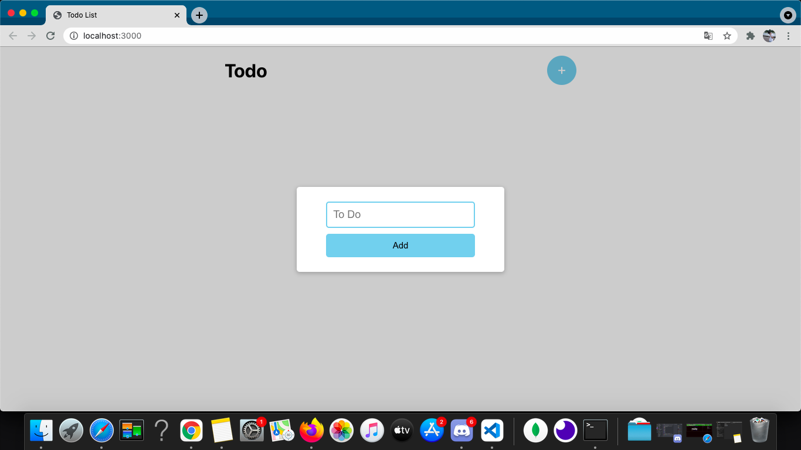
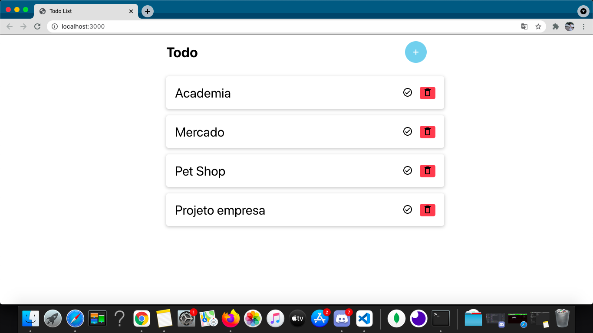
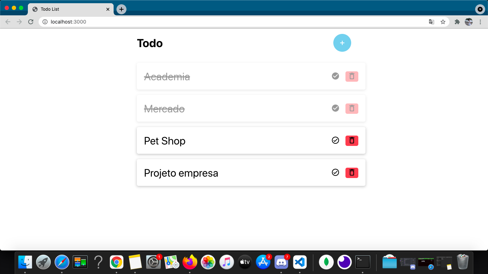

<h1 align="center">📝 To Do List</h1>
<h1>📸 Preview: </h1>

<h1>💻 Projeto: </h1>

Projeto desenvolvido no módulo de ReactJS e React Redux do curso do ProgramadorBR.

O ToDo utiliza o Redux para o gerenciamento de estados entre componentes. 

Lista de tarefas simples com um modal para adicionar novas e botões que 
   removem a tarefa e a marcam como feita.

Foi utilizado o Local Storage para persistência dos dados.

<h1>🚀 Techs:</h1>
<h4> ✔️ JavaScript</h4>
<h4> ✔️ ReactJS</h4>
<h4> ✔️ React Hooks</h4>
<h4> ✔️ Redux</h4>
